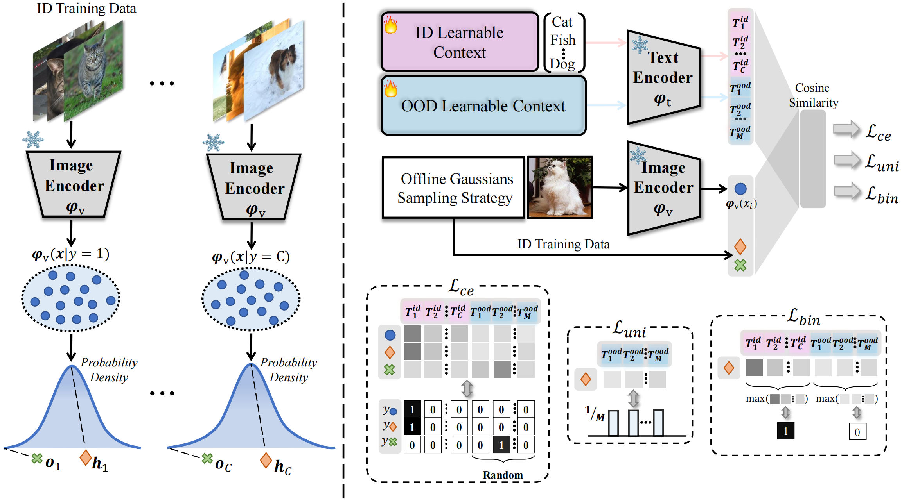

# Likelihood-Aware Semantic Alignment for Full-Spectrum Out-of-Distribution Detection (LSA)

This repository is the implementation for our paper [LSA](https://arxiv.org/abs/2312.01732), and our code will be published upon the acceptance of the manuscript.